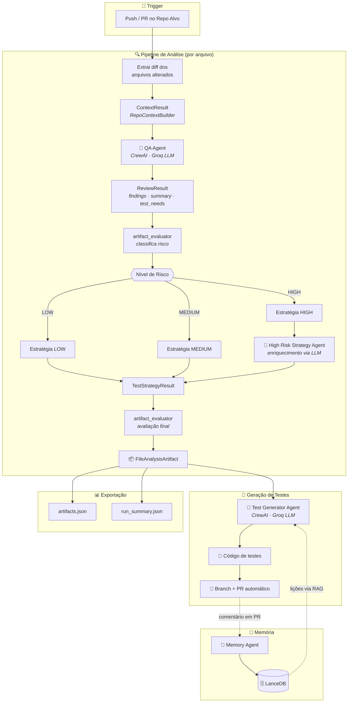

# QAgent 🚀

Pipeline multi-stage com agentes especializados e roteamento condicional para **análise de QA**, **geração de testes** e **aprendizado contínuo** em repositórios automatizados.


---

## Visão Geral

O QAgent é um pipeline multi-stage que coordena agentes de IA especializados para garantir qualidade e extrair inteligência dos ciclos de pull request. Cada etapa do pipeline produz um artefato estruturado que alimenta a etapa seguinte, com handoffs explícitos e contratos tipados via Pydantic.

| Agente / Componente | Descrição |
|----------------------|-----------|
| **QA Agent** | Analisa mudanças de código a partir do *diff*, identificando riscos, tipo de mudança e sugerindo cenários de testes. |
| **High Risk Strategy Agent** | Agente especializado acionado **seletivamente** quando o risco é classificado como HIGH. Enriquece a estratégia de testes via LLM. |
| **Test Generator Agent** | Gera código real de testes automatizados com base na análise e estratégia, submetendo PRs automáticos no repositório alvo. |
| **Memory Agent** | Extrai lições aprendidas de comentários de Code Review e as persiste em banco vetorial (**LanceDB**) para futuras gerações. |

> 📚 **Documentação detalhada:** [Sistema de Memórias & Code Review](docs/memories.md) — como o QAgent captura lições de PRs e as reutiliza via busca vetorial.

---

## Arquitetura Atual

O QAgent utiliza uma arquitetura multi-stage com contratos estruturados entre etapas, roteamento condicional por nível de risco e um orquestrador explícito que coordena o pipeline para cada arquivo analisado.

### Princípios

- **Contratos tipados** — cada etapa produz e consome schemas Pydantic (`ContextResult`, `ReviewResult`, `TestStrategyResult`, `FileAnalysisArtifact`)
- **Handoffs explícitos** — os dados fluem por artefatos estruturados, sem estado implícito
- **Roteamento condicional** — o nível de risco determina qual política de estratégia é aplicada e se o agente HIGH risk é acionado
- **Fallback determinístico** — regras de decisão são determinísticas; o LLM é acionado apenas onde agrega valor (enriquecimento HIGH risk)
- **Observabilidade** — cada etapa registra duração, execução/skip e políticas aplicadas no próprio artefato

### Fluxo do Pipeline



### Componentes Principais

| Componente | Localização | Responsabilidade |
|------------|-------------|------------------|
| **AnalysisOrchestrator** | `src/services/analysis_orchestrator.py` | Coordena o pipeline pós-QA review para um arquivo: avaliação de risco → estratégia → enriquecimento HIGH risk → avaliação final. |
| **FileAnalysisArtifact** | `src/schemas/file_analysis_artifact.py` | Artefato consolidado que carrega todos os dados de uma análise (review, estratégia, risco, observabilidade). |
| **artifact_evaluator** | `src/services/artifact_evaluator.py` | Avalia o artefato e preenche campos de orquestração (risk_level, review_quality, test_generation_recommendation) com regras determinísticas. |
| **test_strategy_builder** | `src/services/test_strategy_builder.py` | Constrói a estratégia de testes com políticas adaptativas por nível de risco (LOW/MEDIUM/HIGH). |
| **HighRiskTestStrategyRunner** | `src/crew/high_risk_strategy_crew.py` | Agente LLM especializado que refina a estratégia de testes para arquivos HIGH risk. Inclui fallback seguro para a estratégia base. |
| **artifact_exporter** | `src/services/artifact_exporter.py` | Exporta artefatos estruturados para JSON e gera resumo da execução. |
| **RepoContextBuilder** | `src/services/context_builder.py` | Extrai contexto do repositório (estrutura, dependências, convenções) para alimentar os agentes. |

---

## Stack

| Componente | Tecnologia |
|------------|------------|
| Linguagem | Python |
| Orquestração de Agentes | CrewAI |
| LLM Provider | Groq (configurável via variáveis de ambiente) |
| Banco Vetorial | LanceDB |
| Embeddings | sentence-transformers |
| CI/CD | GitHub Actions |

---

## Estrutura do Projeto

```text
qagent/
├─ docs/                      # Documentações técnicas
├─ data/lancedb/              # Banco vetorial de memórias
├─ src/
│  ├─ agent/                  # Perfis dos Agentes (Role, Goal, Backstory)
│  ├─ crew/                   # Runners CrewAI (QA, TestGen, HighRisk, Memory)
│  ├─ config/                 # Settings e LLM
│  ├─ prompts/                # Prompts de sistema
│  ├─ schemas/                # Contratos estruturados (Pydantic)
│  │  ├─ file_analysis_artifact.py
│  │  ├─ context_result.py
│  │  ├─ review_result.py
│  │  └─ test_strategy_result.py
│  ├─ services/               # Lógica de negócio e orquestração
│  │  ├─ analysis_orchestrator.py
│  │  ├─ artifact_evaluator.py
│  │  ├─ artifact_exporter.py
│  │  ├─ context_builder.py
│  │  └─ test_strategy_builder.py
│  ├─ tools/                  # Ferramentas customizadas (Memory, Repo)
│  ├─ utils/                  # Git, formatação, PR utils
│  ├─ main.py                 # Entrypoint — Análise de QA
│  └─ main_test_generator.py  # Entrypoint — Geração de Testes
├─ tests/                     # Testes unitários do QAgent
├─ templates/                 # Exemplos de GitHub Actions
└─ requirements.txt
```

---

## Como Instalar

```bash
# 1. Crie e ative um ambiente virtual
python -m venv .venv
# Windows
.\.venv\Scripts\Activate.ps1
# Linux / macOS
source .venv/bin/activate

# 2. Instale as dependências
pip install -r requirements.txt

# 3. Configure as variáveis de ambiente
cp .env.example .env
# Edite .env e defina GROQ_API_KEY, LLM_MODEL, etc.
```

---

## Como Usar Localmente

### Agente de QA (Analisador de Diff)

```bash
python -m src.main \
    --repo-path ./meu-repo \
    --base-sha COMMIT_A \
    --head-sha COMMIT_B \
    --output-file review.md
```

### Agente Gerador de Testes

```bash
python -m src.main_test_generator --repo-path ./meu-repo
```

---

## Status do Projeto

Em desenvolvimento ativo. A arquitetura evolui de forma incremental, priorizando mudanças pequenas e seguras. O pipeline atualmente conta com:

- Orquestração explícita por arquivo via `AnalysisOrchestrator`
- Contratos estruturados entre todas as etapas
- Roteamento condicional com políticas adaptativas por risco
- Agente especializado para cenários de alto risco
- Observabilidade integrada (duração, steps, políticas)
- Exportação de artefatos para JSON

O sistema mantém fallbacks determinísticos e regras de decisão explícitas. A intervenção humana é esperada na revisão dos PRs gerados.
