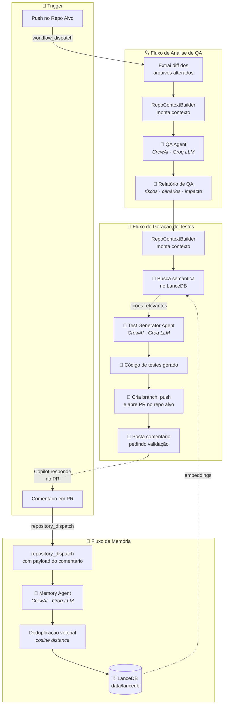

# QAgent 🚀

Um ecossistema de agentes de IA focado em **QA**, **Geração de Testes** e **Aprendizado Contínuo** para repositórios automatizados, garantindo qualidade, segurança e aprimoramento em cada ciclo.


---

## Visão Geral

O QAgent fornece diferentes agentes de IA trabalhando em conjunto para garantir qualidade e extrair inteligência dos ciclos de pull request:

| Agente | Descrição |
|--------|-----------|
| **QA Agent** | Analisa mudanças de código a partir do *diff*, identificando riscos, tipo de mudança e sugerindo cenários de testes manuais e automatizados. |
| **Test Generator Agent** | Gera código real de testes automatizados com base na análise do QA Agent e submete PRs automáticos no repositório alvo. |
| **Memory Agent** | Extrai lições aprendidas a partir de comentários de Code Review e as persiste em um banco vetorial (**LanceDB**) para aprimorar futuras gerações. |

> 📚 **Documentação detalhada:** [Sistema de Memórias & Code Review](docs/memories.md) — como o QAgent captura lições de PRs e as reutiliza via busca vetorial.

---

## Funcionalidades Principais

- **Análise Inteligente de Diff** — filtra automaticamente arquivos irrelevantes (lock, lint, configs) e foca no que importa.
- **Relatórios de Risco** — identifica quebras de contrato, vazamento de credenciais e regressões prováveis.
- **Integração via CI** — invocado pelos repositórios alvo via GitHub Actions (`workflow_dispatch` / `repository_dispatch`).
- **Geração e Push de Testes** — cria testes usando o contexto da `main` e abre PRs automaticamente.
- **Inteligência Vetorial (RAG)** — retém conhecimento coletivo de reviews passados usando embeddings e busca por similaridade (*cosine distance*).

---

## Orquestração dos Agentes



---

## Stack

| Componente | Tecnologia |
|------------|------------|
| Linguagem | Python |
| Orquestração de Agentes | CrewAI |
| LLM Provider | Groq (configurável via variáveis de ambiente) |
| Banco Vetorial | LanceDB |
| Embeddings | sentence-transformers |
| CI/CD | GitHub Actions |

---

## Estrutura do Projeto

```text
qagent/
├─ docs/                      # Documentações técnicas
├─ data/lancedb/              # Banco vetorial de memórias
├─ src/
│  ├─ agent/                  # Perfis dos Agentes (Role, Goal, Backstory)
│  ├─ crew/                   # Orquestração CrewAI (QA, TestGen, Memory)
│  ├─ config/                 # Settings e LLM
│  ├─ prompts/                # Prompts de sistema
│  ├─ schemas/                # Schemas Pydantic
│  ├─ services/               # Context Builder e LLM Client
│  ├─ tools/                  # Ferramentas customizadas (Memory, Repo)
│  ├─ utils/                  # Git, formatação, PR utils
│  ├─ main.py                 # Entrypoint — Agente de QA
│  └─ main_test_generator.py  # Entrypoint — Agente Gerador de Testes
├─ tests/                     # Testes unitários do QAgent
├─ templates/                 # Exemplos de GitHub Actions
└─ requirements.txt
```

---

## Como Instalar

```bash
# 1. Crie e ative um ambiente virtual
python -m venv .venv
# Windows
.\.venv\Scripts\Activate.ps1
# Linux / macOS
source .venv/bin/activate

# 2. Instale as dependências
pip install -r requirements.txt

# 3. Configure as variáveis de ambiente
cp .env.example .env
# Edite .env e defina GROQ_API_KEY, LLM_MODEL, etc.
```

---

## Como Usar Localmente

### Agente de QA (Analisador de Diff)

```bash
python -m src.main \
    --repo-path ./meu-repo \
    --base-sha COMMIT_A \
    --head-sha COMMIT_B \
    --output-file review.md
```

### Agente Gerador de Testes

```bash
python -m src.main_test_generator --repo-path ./meu-repo
```

---

## Status do Projeto

Em pleno desenvolvimento e evolução. As análises e a geração de testes agora contam com abstração completa do pipeline de memória (RAG) utilizando **LanceDB**, elevando a inteligência da CrewAI para os próximos ciclos de CI.
