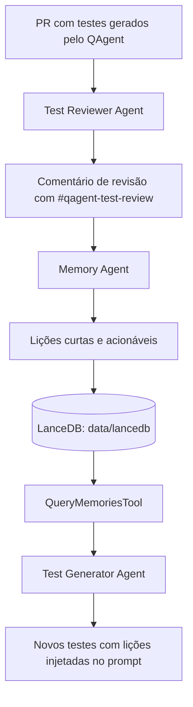

# Sistema de Memórias & Code Review

## Visão geral

O QAgent possui um fluxo de memória para reaproveitar lições aprendidas em revisões de testes gerados automaticamente.

A ideia central é simples:

1. O QAgent gera testes para um repositório alvo.
2. O agente revisor avalia criticamente esses testes.
3. Comentários de revisão contendo aprendizados são transformados em lições curtas e acionáveis.
4. Essas lições são armazenadas em um banco vetorial com **LanceDB**.
5. Em execuções futuras, o gerador de testes consulta memórias semanticamente parecidas e injeta essas lições no prompt para evitar repetir erros.

O objetivo não é substituir a revisão humana, mas criar um ciclo incremental de melhoria: cada revisão relevante melhora as próximas gerações.

---

## Estado atual da implementação

A documentação antiga descrevia uma solução baseada em SQLite, `memories.db`, fuzzy match e `rapidfuzz`. Essa abordagem não representa mais o caminho atual do projeto.

No estado atual do código, o sistema de memórias usa:

| Item | Implementação atual |
|------|---------------------|
| Banco de memória | LanceDB |
| Diretório padrão | `data/lancedb` versionado com memórias iniciais do MVP |
| Tabela | `memories` |
| Modelo de embedding | `sentence-transformers/all-MiniLM-L6-v2` |
| Dimensão do vetor | 384 |
| Consulta | Busca vetorial por similaridade |
| Uso principal | Injetar lições aprendidas no prompt do gerador de testes |

> Observação importante: no ZIP avaliado, a leitura/consulta de memórias está implementada em `src/tools/memory_tools.py`. A documentação abaixo descreve o fluxo esperado e o que já está refletido no código, mas o fluxo completo de ingestão automatizada via GitHub Actions/script ainda precisa ser validado no repositório.

---

## Arquitetura do fluxo



---

## Componentes envolvidos

### `src/tools/memory_tools.py`

Responsável pela integração com o LanceDB.

Principais responsabilidades:

- criar/conectar ao banco `data/lancedb`;
- criar a tabela `memories`, caso ela ainda não exista;
- carregar o modelo de embeddings `all-MiniLM-L6-v2` de forma lazy;
- consultar memórias semanticamente parecidas;
- listar memórias existentes.

Principais elementos:

| Elemento | Função |
|---------|--------|
| `MemoryModel` | Schema da tabela LanceDB |
| `_get_table()` | Abre/cria a tabela `memories` |
| `get_encoder()` | Inicializa o modelo de embeddings sob demanda |
| `QueryMemoriesTool` | Busca memórias relevantes por similaridade vetorial |
| `ListAllMemoriesTool` | Lista memórias armazenadas por data decrescente |
| `fetch_all_lessons()` | Retorna lições salvas para inspeção/listagem |
| `save_lesson()` | Persiste uma lição usando o schema oficial e gerando embedding |

---

### `src/crew/test_generator_crew.py`

Antes de gerar testes, o `TestGeneratorCrewRunner` monta uma consulta baseada em:

- caminho do arquivo alvo;
- trecho inicial do código fonte;
- contexto da geração de testes.

A consulta é enviada para `QueryMemoriesTool` com limite padrão de 5 memórias relevantes.

Quando memórias são encontradas, o runner registra:

| Campo | Descrição |
|------|-----------|
| `last_memory_query` | Consulta usada na busca vetorial |
| `last_memories_raw` | Texto bruto retornado pela ferramenta |
| `last_memories_used` | Lista estruturada de memórias usadas |

Esses dados depois podem ser persistidos no artefato de análise.

---

### `src/tasks/test_generator_task.py`

Quando existem memórias relevantes, elas são injetadas no prompt do gerador de testes dentro do bloco:

```text
IMPORTANTE — Lições aprendidas de execuções anteriores (NÃO repita estes erros):
[INICIO_MEMORIAS]
...
[FIM_MEMORIAS]
```

Isso orienta o agente a evitar problemas já identificados em revisões anteriores, como:

- nomes genéricos de testes;
- ausência de mocks;
- duplicação de cenários;
- baixa cobertura de casos negativos;
- testes frágeis ou dependentes de serviços externos.

---

### `src/schemas/file_analysis_artifact.py`

O artefato de análise possui campos específicos para rastrear o uso das memórias:

| Campo | Descrição |
|------|-----------|
| `memory_query` | Consulta usada para buscar memórias no banco vetorial |
| `memories_used_raw` | Texto bruto das memórias recuperadas |
| `memories_used` | Lista estruturada das memórias utilizadas na geração |

Esses campos são importantes para auditoria: permitem saber se uma geração de testes foi influenciada por aprendizados anteriores.

---

## Schema atual da memória no LanceDB

A tabela `memories` segue o modelo definido em `MemoryModel`:

| Campo | Tipo | Descrição |
|------|------|-----------|
| `id` | `str` | Identificador único da memória |
| `repo` | `str` | Repositório de origem |
| `pr_number` | `int` | Número do PR relacionado |
| `lesson` | `str` | Lição curta e acionável |
| `original_comment` | `str` | Comentário original usado como fonte |
| `author` | `str` | Autor do comentário/revisão |
| `created_at` | `str` | Data/hora de criação |
| `tags` | `str` | Tags auxiliares para classificação |
| `vector` | `Vector(384)` | Embedding da lição |

---

## Como a busca de memórias funciona

1. O QAgent monta uma query textual com o arquivo e parte do código.
2. A query é convertida em embedding pelo modelo `all-MiniLM-L6-v2`.
3. O LanceDB executa uma busca vetorial na tabela `memories`.
4. O QAgent limita os resultados mais relevantes.
5. Resultados com distância acima do threshold configurado são descartados.
6. As lições restantes são formatadas e injetadas no prompt do gerador de testes.

Atualmente, o threshold usado na ferramenta é:

```python
if dist > 1.3:
    continue
```

Ou seja, memórias muito distantes semanticamente são ignoradas.

---

## Exemplo de retorno de memória

```text
[distance=0.421] (PR #63 em jrcosta/repo_alvo_api_simples, por qagent[bot])
  Lição: Validar campos novos no contrato JSON.

[distance=0.612] (PR #64 em jrcosta/repo_alvo_api_simples, por qagent[bot])
  Lição: Mockar chamadas externas em vez de depender de serviços reais.
```

Esse formato também é interpretado por `_parse_memory_result()` em `src/crew/test_generator_crew.py`, que transforma o texto bruto em uma lista estruturada.

---

## Como testar localmente a consulta

Depois de instalar as dependências:

```bash
pip install -r requirements.txt
```

Você pode testar a leitura/listagem com Python:

```bash
python - <<'PY'
from src.tools.memory_tools import QueryMemoriesTool, ListAllMemoriesTool

print("=== Todas as memórias ===")
print(ListAllMemoriesTool()._run(limit=10))

print("\n=== Busca semântica ===")
print(QueryMemoriesTool()._run(
    query="Gerar testes unitários para serviço com dependência externa e validação de contrato JSON",
    limit=5,
))
PY
```

Se ainda não houver banco ou registros, a saída esperada será algo como:

```text
Nenhuma memória disponível ainda (banco não existe).
```

ou:

```text
Nenhuma memória registrada ainda.
```

---

## Como deveria funcionar a ingestão

O fluxo esperado para ingestão é:

1. O agente revisor publica um comentário com `#qagent-test-review`.
2. Um workflow no repositório alvo filtra comentários com essa hashtag.
3. O comentário é encaminhado ao repositório do QAgent via `repository_dispatch`.
4. Um workflow no QAgent executa um script de ingestão.
5. O `MemoryCrewRunner` transforma o comentário em lições curtas.
6. As lições são convertidas em embeddings.
7. As lições são gravadas na tabela `memories` do LanceDB.

No ZIP avaliado, existe o template:

```text
templates/forward-qagent-test-review-comment.yml
```

Esse arquivo representa o lado do repositório alvo, responsável por encaminhar comentários contendo `#qagent-test-review`.

Para completar a rastreabilidade do fluxo, recomenda-se garantir que existam também:

```text
.github/workflows/ingest-pr-comment.yml
.github/scripts/ingest_comment.py
```

E que o script de ingestão grave dados no LanceDB usando o mesmo schema de `MemoryModel`.

---

## Exemplo de escrita no LanceDB

Scripts de ingestão devem usar `save_lesson()` em vez de duplicar a criação de vetor e o schema da tabela:

```python
from src.tools.memory_tools import save_lesson

save_lesson(
    repo="jrcosta/repo_alvo_api_simples",
    pr_number=42,
    lesson="Mockar chamadas externas em vez de depender de serviços reais.",
    original_comment="#qagent-test-review ...",
    author="qagent[bot]",
    tags="test-review,mock,external-dependency",
)
```

---

## Recomendações de evolução

### 1. Implementar deduplicação semântica

Antes de inserir uma nova lição, consultar memórias parecidas e evitar duplicatas.

Critérios possíveis:

- mesma lição normalizada;
- distância vetorial abaixo de um threshold forte;
- mesmo repositório + mesmo tipo de problema.

---

### 2. Separar dependências de runtime e desenvolvimento

Como `sentence-transformers` pode ser pesado, vale separar dependências em:

```text
requirements.txt
requirements-dev.txt
```

Ou migrar para `pyproject.toml` com grupos de dependências.

---

### 3. Versionar exemplos de memórias

Criar um pequeno script ou fixture para popular memórias fake em ambiente local:

```text
scripts/seed_memories.py
```

Isso facilita demonstrar o ciclo:

```text
memória salva → busca semântica → injeção no prompt → artefato com memories_used
```

---

### 4. Documentar privacidade e retenção

Como comentários de PR podem conter trechos de código, decisões técnicas ou nomes de pessoas, é importante documentar:

- o que pode ser salvo;
- o que não deve ser salvo;
- se comentários completos devem ser persistidos;
- quando anonimizar dados;
- como limpar `data/lancedb`.

---

## Limitações atuais

- O banco local em `data/lancedb` funciona bem para uso inicial, mas pode não ser ideal para múltiplas execuções concorrentes em CI.
- O modelo `all-MiniLM-L6-v2` é leve e prático, mas pode perder nuances de domínio em casos complexos.
- O threshold de distância ainda é heurístico e precisa ser calibrado com dados reais.
- A ingestão automatizada precisa estar alinhada ao schema atual do LanceDB.
- `data/lancedb` está versionado para que o agente reutilize lições aprendidas entre execuções no MVP. Evite gravar dados sensíveis ou conteúdo de PRs privados nesse banco versionado; para produção, defina uma estratégia explícita de persistência externa ou cache controlado.

---

## Próximos passos recomendados

1. Criar/validar script `.github/scripts/ingest_comment.py` usando LanceDB.
2. Criar workflow `.github/workflows/ingest-pr-comment.yml`.
3. Implementar deduplicação antes de inserir novas memórias.
4. Criar `scripts/seed_memories.py` para demo local.
5. Atualizar README com um exemplo curto de uso das memórias.
