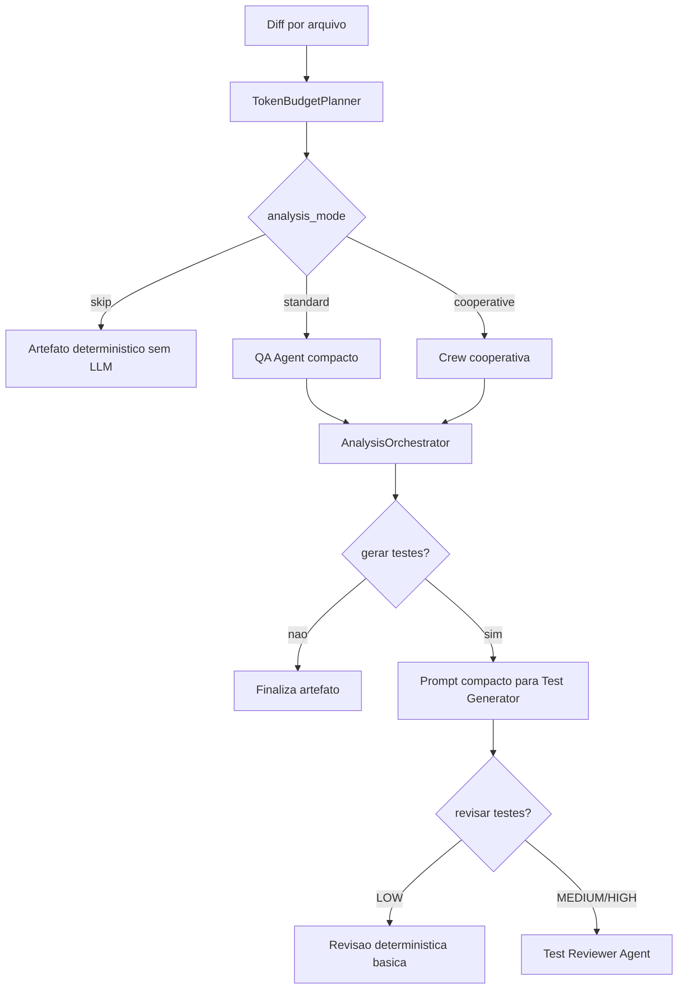

# Token Saver Flow no QAgent

## Status

Fluxo implementado na camada determinística do QAgent.

Arquivos principais:

- `src/schemas/token_budget.py`
- `src/services/token_budget_planner.py`
- `src/services/context_builder.py`
- `src/main.py`
- `src/main_test_generator.py`
- `src/services/artifact_exporter.py`

O objetivo original era criar uma decisão antes das chamadas LLM principais. Agora cada arquivo recebe um `TokenBudgetPlan`, armazenado no `FileAnalysisArtifact`, para indicar qual fluxo foi escolhido e qual orçamento de contexto foi aplicado.

## Resumo executivo

Existe espaco claro para economizar tokens no QAgent, e a primeira versão do fluxo já foi incorporada ao pipeline.

Hoje o pipeline ja tem algumas boas decisoes, como fallback deterministico, geracao de estrategia por risco e enriquecimento LLM apenas para arquivos `HIGH`. Mas, com o modo cooperativo ativado no workflow, o custo tende a subir bastante porque a analise inicial passa a envolver gerente e especialistas usando o mesmo diff, codigo completo e contexto adicional.

A evolução aplicada cria um **Token Saver Flow**, antes das chamadas LLM principais, para decidir:

1. Se o arquivo precisa mesmo de analise cooperativa.
2. Quanto contexto enviar.
3. Se a geracao/revisao de testes pode usar artefatos estruturados em vez de markdown completo.
4. Se a memoria vetorial deve ser consultada/injetada ou ignorada.

## Pontos onde tokens sao gastos hoje

### 1. Analise inicial

Arquivos:

- `src/main.py`
- `src/crew/qa_crew.py`
- `src/crew/cooperative_analysis_crew.py`
- `src/tasks/qa_task.py`
- `src/tasks/cooperative_analysis_task.py`

Hoje, para cada arquivo alterado, o QAgent envia ao LLM:

- diff completo
- conteudo completo do arquivo
- contexto adicional do repositorio
- instrucoes longas de saida

No modo cooperativo, esse custo aumenta porque a Crew hierarquica coordena mais agentes.

### 2. Contexto do repositorio

Arquivo:

- `src/services/context_builder.py`

O `RepoContextBuilder` hoje monta contexto com:

- arquivos relacionados pelo nome
- testes existentes encontrados
- snippets de arquivos relacionados
- snippets de testes existentes

Cada snippet pode ter ate `3000` caracteres, com ate:

- `4` arquivos relacionados
- `8` arquivos de teste

Isso pode gerar bastante contexto, especialmente em repositorios grandes.

### 3. Geracao de testes

Arquivos:

- `src/main_test_generator.py`
- `src/crew/test_generator_crew.py`
- `src/tasks/test_generator_task.py`

O gerador recebe:

- relatorio QA em markdown
- codigo completo
- contexto adicional
- estrategia de teste
- memorias relevantes

Boa parte disso pode ser reduzida usando o artefato estruturado (`FileAnalysisArtifact`) em vez do markdown inteiro.

### 4. Revisao critica dos testes

Arquivos:

- `src/main_test_reviewer.py`
- `src/tasks/test_reviewer_task.py`

A revisao recebe:

- codigo original completo
- diff
- relatorio QA
- estrategia
- testes gerados

Esse e outro ponto caro. Da para reduzir usando somente trechos relevantes do codigo e estrategia estruturada.

## Fluxo implementado: Token Saver Flow

### Objetivo

Criar uma etapa deterministica antes das chamadas LLM para calcular um orcamento de contexto por arquivo.

Exemplo de saída registrada por arquivo:

```json
{
  "file_path": "java-api/src/main/java/UserController.java",
  "change_size": "small",
  "risk_hint": "medium",
  "analysis_mode": "standard",
  "context_level": "compact",
  "include_memory": true,
  "include_full_file": false,
  "max_context_chars": 6000
}
```

## Proposta de arquitetura

### Serviço

```text
src/services/token_budget_planner.py
```

Responsabilidades:

- medir tamanho do diff
- medir tamanho do arquivo
- classificar tipo de arquivo
- detectar arquivos triviais
- escolher modo de analise
- limitar contexto
- registrar politica aplicada no artefato

### Schema

```text
src/schemas/token_budget.py
```

Campos principais:

```python
class TokenBudgetPlan(BaseModel):
    file_path: str
    change_size: Literal["small", "medium", "large"]
    analysis_mode: Literal["skip", "standard", "cooperative"]
    context_level: Literal["none", "compact", "standard", "expanded"]
    include_full_file: bool
    include_memory: bool
    max_context_chars: int
    reason: str
```

O schema real também registra `risk_hint`, usado como sinal determinístico antes da revisão LLM.

## Observabilidade

O fluxo escolhido fica visível em dois níveis:

1. `artifacts.json`
   - cada `FileAnalysisArtifact` contém `token_budget_plan`
   - `applied_policies` inclui entradas como `token_budget_standard`, `token_budget_skip` e `context_compact`
   - `executed_steps` e `skipped_steps` indicam se houve review LLM, review determinística ou downgrade do modo cooperativo
   - `diagnostic_notes` guarda o `reason` do planner

2. `run_summary.json`
   - `analysis_flow_distribution` resume quantos arquivos usaram `skip`, `standard` ou `cooperative`
   - `context_level_distribution` resume `none`, `compact`, `standard` e `expanded`

Também há log no console por arquivo:

```text
Fluxo escolhido: standard | contexto=compact | arquivo_completo=True
```

## Regras sugeridas

### 1. Nao usar modo cooperativo para mudancas pequenas

Exemplos:

- alteracao de um campo em DTO
- mudanca em documentacao
- ajuste simples de teste
- mudanca em arquivo `.md`, `.yml`, `.json` sem logica critica

Regra:

```text
Se diff < 80 linhas e arquivo nao for controller/service/security/db:
usar QA padrao, nao cooperativo.
```

Implementado no `TokenBudgetPlanner`: se `--cooperative-analysis` for solicitado, mudanças pequenas sem sinal de alto risco são roteadas para `standard` e registradas como `cooperative_analysis` pulado pelo orçamento.

Economia esperada: alta.

### 2. Enviar diff completo, mas nao sempre o arquivo completo

Hoje o task envia `code_content` inteiro.

Melhor:

```text
Se arquivo > 12k caracteres:
enviar apenas janela ao redor das linhas alteradas + assinaturas/classes proximas.
```

Implementado por `build_code_content_for_plan`, que mantém janelas ao redor das linhas adicionadas no diff e inclui um cabeçalho indicando compactação.

Economia esperada: media/alta em arquivos grandes.

### 3. Contexto compacto por padrao

Hoje o contexto pode carregar muitos testes e arquivos relacionados.

Sugestao:

- LOW: somente lista de testes existentes
- MEDIUM: lista + 1 ou 2 snippets
- HIGH: contexto expandido
- COOPERATIVE: contexto standard, nao maximo

Implementado no `RepoContextBuilder` via `context_level`. O nível `compact` mantém lista de testes existentes, mas omite snippets de testes; `standard` e `expanded` incluem mais conteúdo.

### 4. Memoria sob demanda

Hoje o gerador consulta memoria sempre que vai gerar testes.

Sugestao:

```text
Consultar memoria so se:
- houver geracao de testes recomendada
- arquivo for MEDIUM/HIGH
- existir linguagem/framework reconhecido
```

Tambem limitar a injecao para as top `2` ou `3` licoes, nao `5`, exceto em HIGH.

Implementado no gerador de testes:

- `LOW`: até 2 memórias
- `MEDIUM`: até 3 memórias
- `HIGH`: até 5 memórias
- `include_memory=false`: consulta pulada

### 5. Usar artefato estruturado em vez de markdown completo

O gerador de testes hoje recebe `section_report` em markdown.

Melhor fluxo:

```text
ReviewResult + TestStrategyResult -> prompt compacto
```

Implementado por `render_compact_generation_report`, que transforma `ReviewResult` e `TestStrategyResult` em uma entrada curta com `Findings`, `Test needs` e `Strategy`.

Exemplo de prompt reduzido:

```text
Findings:
- WARN: validacao de is_vip pode aceitar tipos incorretos

Test needs:
- cobrir default false
- rejeitar valores nao booleanos

Strategy:
- UNIT HIGH: validar StrictBool
```

Economia esperada: media.

## Fluxo ideal



## Prioridade de implementacao

### Alta

1. Criar `TokenBudgetPlanner`. **Implementado.**
2. Desativar cooperativo automaticamente para mudancas pequenas/triviais. **Implementado.**
3. Reduzir `code_content` para snippet em arquivos grandes. **Implementado.**
4. Registrar `token_budget_plan` no artefato. **Implementado.**

### Media

5. Tornar `RepoContextBuilder` adaptativo por nivel de contexto. **Implementado.**
6. Usar `ReviewResult` e `TestStrategyResult` compactados no gerador. **Implementado.**
7. Limitar memorias por risco. **Implementado.**

### Baixa

8. Estimar tokens com biblioteca dedicada.
9. Criar cache de contexto por arquivo.
10. Criar metricas historicas de tokens por etapa no Pages.

## Conclusao

O fluxo mais valioso agora e:

> **TokenBudgetPlanner antes da analise**, decidindo se usa `skip`, `standard` ou `cooperative`, e quanto contexto cada etapa recebe.

Isso combina bem com a arquitetura atual do QAgent porque mantem a filosofia do projeto: decisoes criticas ficam deterministicas, e o LLM e usado onde realmente agrega valor.
